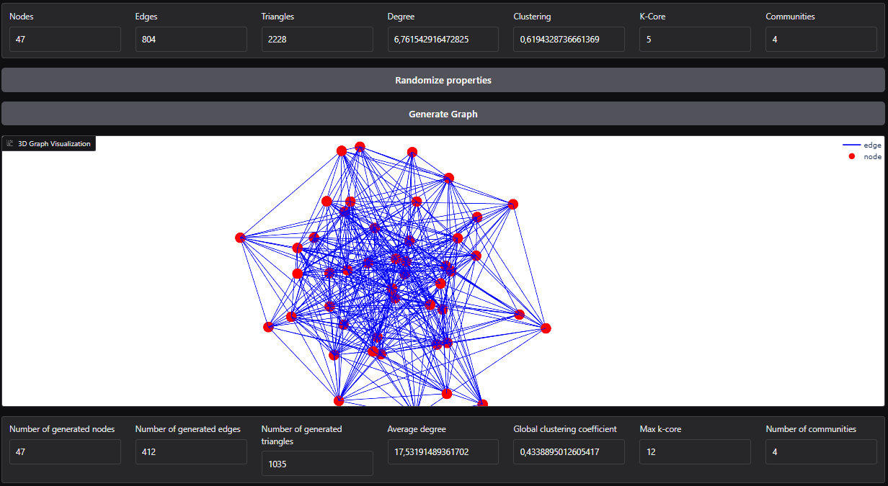

# GGSP-ALTEGRAD

## Demo

[Quick demo hosted at HF](https://huggingface.co/spaces/ymachta/GGSP-Project)



## Context
Challenge: [Generating Graphs from specified properties for the ALTEGRAD course](https://www.kaggle.com/competitions/generating-graphs-with-specified-properties/overview)


## Folder structure


```
.Repo
├── NGG                    # Main module folder for the NGG project
│   ├── main.py            # Entry point or table of contents for the project
│   ├── train_utils        # Utilities and scripts for training models
│   │   ├── parser.py               # Script for parsing input arguments
│   │   ├── load_or_not_deepsets.py # Logic for loading or skipping DeepSets models
│   │   ├── load_or_not_stats_model.py # Logic for loading or skipping statistical models
│   │   ├── load_autoencoder.py    # Script for loading autoencoder models
│   │   ├── train_autoencoder.py   # Script for training autoencoder models
│   │   ├── train_denoiser.py      # Script for training denoiser models
│   │   └── check_results.py       # Script for checking training results
│   ├── utils              # Utility functions and scripts for general use
│   │   ├── extracts_feats.py      # Script for extracting features
│   │   ├── utils.py               # General utility functions
│   │   ├── verify_dataset_distribution.py # Script to verify dataset distribution
│   │   └── verify_graph_features.py      # Script to verify graph features
│   ├── autoencoders       # Folder containing autoencoder implementations
│   │   ├── autoencoder_base.py      # Base class for autoencoders
│   │   ├── autoencoder_concat.py    # Concatenation-based autoencoder
│   │   ├── autoencoder_GMVAE.py     # Gaussian Mixture VAE implementation
│   │   ├── autoencoder_GMVAEv2.py   # Version 2 of Gaussian Mixture VAE
│   │   ├── components               # Sub-folder for components used in autoencoders
│   │   │   ├── deepsets.py            # DeepSets component
│   │   │   ├── encoders               # Sub-folder for encoder components
│   │   │   │   ├── GIN_base.py          # Base GIN encoder
│   │   │   │   └── GIN_concat.py        # GIN encoder with concatenation
│   │   │   ├── decoders               # Sub-folder for decoder components
│   │   │   │   ├── decoder_base.py      # Base decoder
│   │   │   │   └── decoder_norm.py      # Normalization-based decoder
│   ├── Denoisers          # Folder for denoiser models
│   │   └── denoise_model.py      # Denoiser model implementation
│   └── commands.txt       # File containing various command line commands for reference
├── data                   # Folder to store datasets
├── progression_archive    # Folder for archiving progression and old versions
├── model_weights          # Folder to store model weights
└── setup.py               # Setup script for installing dependencies and packages
```


## Data

10000 synthetic graphs:
- 8000 Trainset
- 1000 Validation set
- 1000 Test set

Place the train, val and test data from [The kaggle dataset](https://www.kaggle.com/competitions/generating-graphs-with-specified-properties/data) in the .data/ folder you'll add.


## Model architechture and training

🚧 Work in Progress

Check the [report in the repository](Project_report.pdf)

## Installation, Usage and Commands

Start by setting up the environment by runnning:

``` bash
pip install -r requirements.txt
```

setup the module NGG by using 

``` bash
pip install -e .
```

to train the model, use NGG/main.py with this command 

``` bash
python NGG/main.py --n-layers-decoder 6 --n-layers-encoder 4 --n-layers-denoise 4 \
--epochs-denoise 200 --epochs-autoencoder 200 --AE concat (or GMVAE) \
--name $Name_of_experiment --timesteps 1000 --additional
```

- ```--penalization-hyperparameters 1 ``` #to add MSE losses for n_nodes, n_triagles and n_edges
- ```--normalize ``` #adds self loops to the adj matrices

## References

